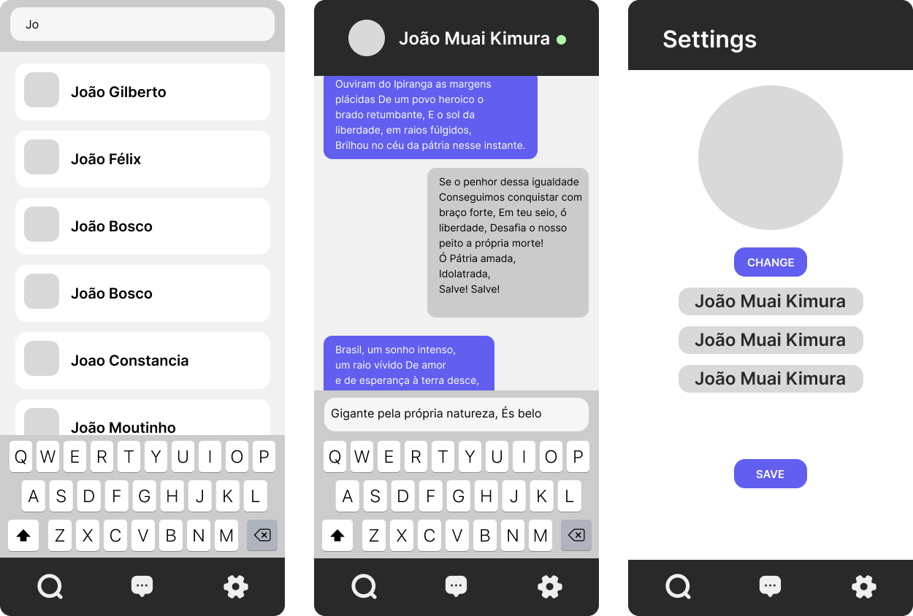
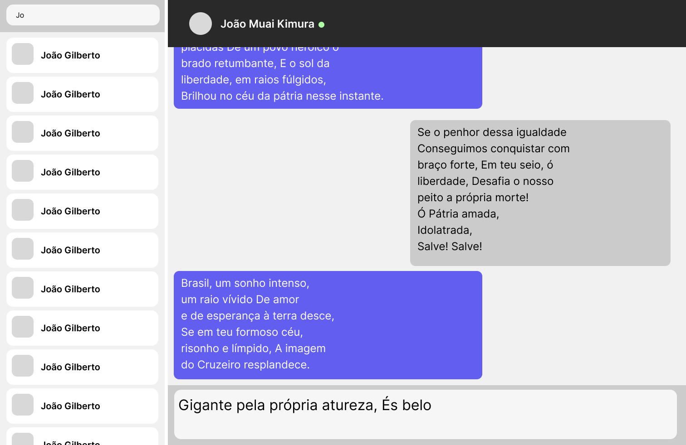

<div align="center">
  <a href="https://github.com/adamerikoff/begleiter">
    
  </a>

  <h3 align="center">begleiter</h3>

  <p align="center">
    NachrichtensofortversandApplikation
  </p>
</div>


<!-- TABLE OF CONTENTS -->
<details>
  <summary>Table of Contents</summary>
  <ol>
    <li>
      <a href="#about-the-project">About The Project</a>
      <ul>
        <li><a href="#built-with">Built With</a></li>
      </ul>
    </li>
    <li>
      <a href="#getting-started">Getting Started</a>
      <ul>
        <li><a href="#prerequisites">Prerequisites</a></li>
        <li><a href="#installation">Installation</a></li>
      </ul>
    </li>
    <li><a href="#license">License</a></li>
    <li><a href="#contact">Contact</a></li>
    <li><a href="#acknowledgments">Acknowledgments</a></li>
  </ol>
</details>


<!-- ABOUT THE PROJECT -->
## About The Project

Erlang backed messaging application with front-end clients in IOS, Android and Web.

<div align="center">
  
  </br>
  </br>
  
</div>


<p align="right">(<a href="#readme-top">back to top</a>)</p>


### Built With

* <div >
    <a href="https://www.erlang.org/">
      
    </a>
  </div>
* <div >
    <a href="https://developer.apple.com/swift/">
      
    </a>
  </div>
* <div >
    <a href="https://vuejs.org/">
      
    </a>
  </div>
* <div >
    <a href="https://kotlinlang.org/">
      
    </a>
  </div>

<p align="right">(<a href="#readme-top">back to top</a>)</p>


## Getting Started

This is an example of how you may give instructions on setting up your project locally.
To get a local copy up and running follow these simple example steps.

### Prerequisites

This is an example of how to list things you need to use the software and how to install them.
* npm
  ```sh
  npm install npm@latest -g
  ```

### Installation

_Below is an example of how you can instruct your audience on installing and setting up your app. This template doesn't rely on any external dependencies or services._

1. Get a free API Key at [https://example.com](https://example.com)
2. Clone the repo
   ```sh
   git clone https://github.com/your_username_/Project-Name.git
   ```
3. Install NPM packages
   ```sh
   npm install
   ```
4. Enter your API in `config.js`
   ```js
   const API_KEY = 'ENTER YOUR API';
   ```

<p align="right">(<a href="#readme-top">back to top</a>)</p>

<!-- LICENSE -->
## License

No license at this moment.

<p align="right">(<a href="#readme-top">back to top</a>)</p>


<!-- CONTACT -->
## Contact
Project Link: [https://github.com/adamerikoff/begleiter](https://github.com/adamerikoff/begleiter)

<p align="right">(<a href="#readme-top">back to top</a>)</p>


<!-- ACKNOWLEDGMENTS -->
## Acknowledgments

* [Img Shields](https://shields.io)

<p align="right">(<a href="#readme-top">back to top</a>)</p>
